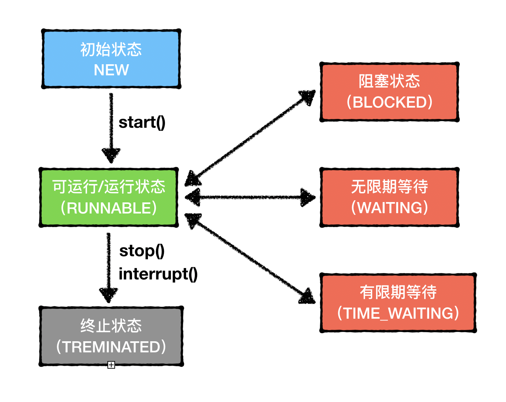

# 线程

线程是我们在并发编程中打交道最多的概念，Java里面的线程也就相当于操作系统中的线程。

### 通用线程生命周期

既然要使用线程，那么我们需要对线程进行深入的了解。

线程对于我们来说，最重要的就是生命周期。通用的线程生命周期有五种状态：**初始状态**、**可运行状态**、**运行状态**、**休眠状态**和**终止状态**。

上面的模型也被称为**五态模型**：

1. **初始状态**：指的是线程已被创建，但是还不允许被CPU调度。这里的创建是编程语言层面的创建，而不是操作系统层面的创建。
2. **可运行状态**：线程可以被CPU调度执行了，具体调度要看CPU。这时操作系统里创建线程成功了。
3. **运行状态**：如果线程被分配到了CPU执行，就会变味运行状态
4. **休眠状态**：运行状态的线程如果调用了一个阻塞的API或者等待某个条件变量，线程就会切换到休眠状态，释放CPU的使用权，休眠的线程无法获取CPU的使用权，除非等待时间出现了，会从休眠状态转换到可运行状态。
5. **终止状态**：线程执行完，或者出现异常会进入终止状态。

### Java线程生命周期

Java中的线程有六个状态：

1. NEW（初始化状态）
2. RUNNABLE（可运行/运行状态）
3. BLOCKED（阻塞状态）
4. WAITING（无时限等待）
5. TIMED_WAITING（有时限等待）
6. TERMINATED（终止状态）

其中BLOCKED、WAITING、TIMED_WAITING都是一种状态，也就是休眠对状态。处于这三种状态无法获取CPU执行权。

Java线程的生命周期和状态转换如下：

**初始状态 -> 可运行状态 -> 终止状态**的状态流转不难理解，详细说下可运行状态和休眠状态的转换条件：

#### 从RUNNABLE到BOLCKED

只有一种场景会触发这种转换，就是等待synchronized隐式锁。当等待线程获得synchronized隐式锁后，又会从BOLCKED转换到RUNNABLE状态。

这里需要注意：调用阻塞API（比如IO操作）时，操作系统的线程状态为休眠状态，而Java中的线程状态依旧是运行状态。

#### 从RUNNABLE到WAITING

有三种场景会触发该类型状态转换：

1. 在synchronized的临界区中，调用**Object.wait()**方法
2. 调用无参数的**Thread.join()**方法，当前线程会等待join线程执行结束后恢复RUNNABLE状态
3. 使用**LockSupport.park()**方法，在调用**LockSupport.unpark()**方法后才会恢复到RUNNABLE状态

#### 从RUNNABLE到TIME_WAITING

有五种场景会触发该类型状态转换：

1. **Thread.sleep(long millis)**方法
2. 在获得synchronized隐式锁的线程调用，**Object.wait(long millis)**方法
3. **Thread.join(long millis)**方法
4. **LockSupport.parkNanos(Object blocker, long deadline)**方法
5. **LockSuppor.parkUntil(long deadline)**方法

对于休眠状态，WAITING和TIME_WAITING是可以都归于等待状态，需要被唤醒或者根据设置的超时时间自己唤醒。

那么BLOCKED的状态和他们有什么区别呢？细心观察可以发现两个WAITING对应的方法都是可以响应中断的（throws InterruptedException）。

BLOCKED状态的线程，只能等竞争synchronized，无法响应中断。

### 小总结

了解线程的各个状态，对于我们排查各种死锁、活锁、饥饿问题有很大帮助。

我们可以通过jstack观察线程的栈信息。