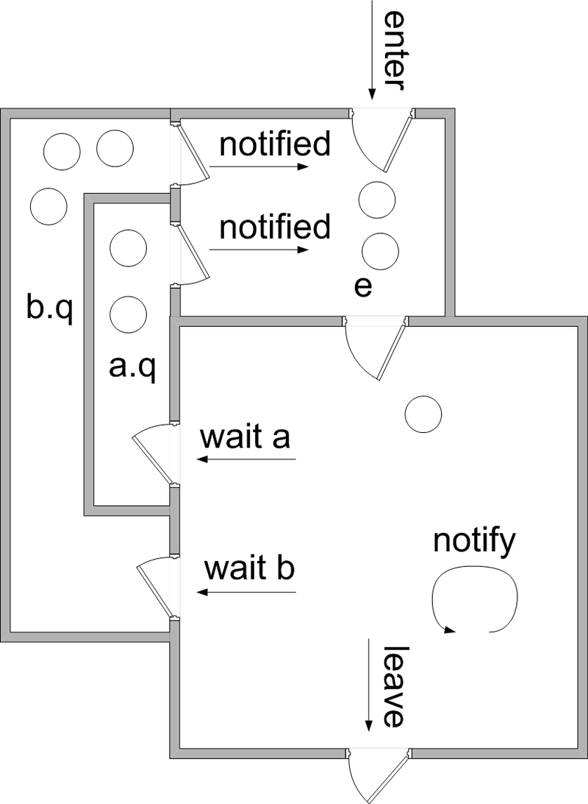
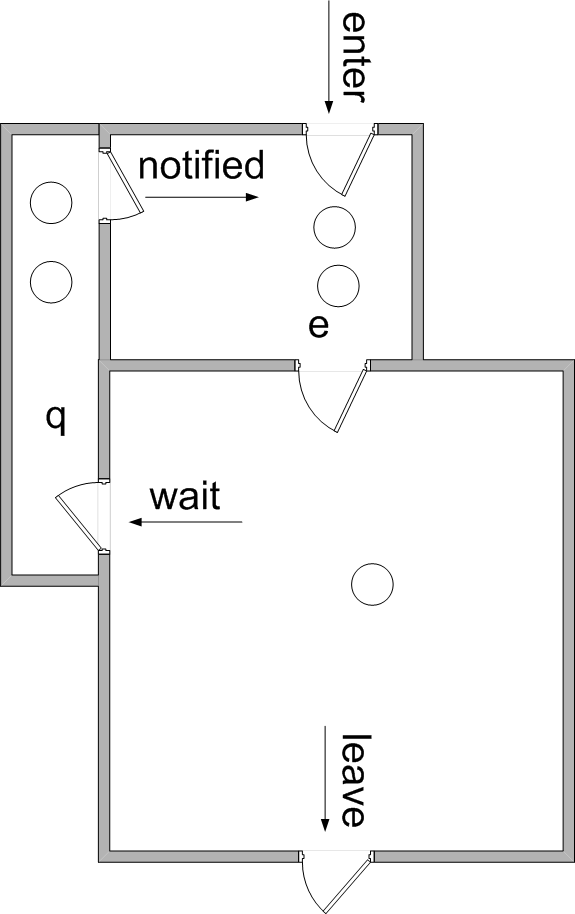

# synchronized

synchronized是Java中用来实现多线程同步访问共享资源的关键字。

先来一个没有经过synchronized加持的方法，例子是chapter01包下的SyncTest，请自取食用。

````java
public class SyncTest {

    private int count = 0;

    public void add(){
        int i = 0;
        while(i++ < 10000){
            count = count + 1;
        }
    }

    public void getCount(){
        System.out.println(count);
    }


    public static void main(String[] args) throws Exception{
        SyncTest syncTest = new SyncTest();
        Thread t1 = new Thread(syncTest::add);
        Thread t2 = new Thread(syncTest::add);

        t1.start();
        t2.start();

        t1.join();
        t2.join();

        syncTest.getCount();
    }
}
````

运行main方法，可以发现每次执行结果都不相同，而且都不等于20000。

当我们给add方法里面加入synchronized后，结果就是正常的20000。

````java
public final Object lock = new Object();

public void add(){
    synchronized (lock){
        int i = 0;
        while(i++ < 10000){
            count = count + 1;
        }
    }
}
````

这里synchronized关键字帮我们做了什么呢？

### synchronized的Happens-Before

> 1. 对一个锁的解锁，Happens-Before随后对这个锁的加锁操作。
> 2. Happens-Before的传递性原则。

根据以上两条规则，例子中有两个线程t1和t2访问变量count，由于add()方法用synchronized修饰，同一时刻只有一个线程可以获取到隐式锁，假设t1线获取到锁，对count操作，之后t1解锁，t2成功获取到锁。

根据Happens-Before原则，t1释放锁 Happens-Before t2加锁，所以t1的操作对t2来说是可见的。

Happens-Before是规范上的东西，那么具体是如何实现的呢？

### synchronized的class文件

对于SyncTest文件，执行以下命令获取编译后的class文件。

> javac SyncTest.java
>
> javap -c SyncTest

add方法编译后指令如下：

````java
public void add();
    Code:
       0: aload_0
       1: getfield      #4                  // Field lock:Ljava/lang/Object;
       4: dup
       5: astore_1
       6: monitorenter											// 1.这里是加隐式锁
       7: iconst_0
       8: istore_2
       9: iload_2
      10: iinc          2, 1
      13: sipush        10000
      16: if_icmpge     32
      19: aload_0
      20: aload_0
      21: getfield      #2                  // Field count:I
      24: iconst_1
      25: iadd
      26: putfield      #2                  // Field count:I
      29: goto          9
      32: aload_1
      33: monitorexit												// 2.这里是释放隐式锁
      34: goto          42
      37: astore_3
      38: aload_1
      39: monitorexit												// 3.这里是异常时释放隐式锁
      40: aload_3
      41: athrow
      42: return
````

由此可见，synchronized关键字会在代码编译时使用monitorenter和monitorexit，来达到变量的互斥访问。

* monitorenter指令：插入在同步代码块的开始位置，当代码执行到此处，尝试获取该对象Monitor的所有权，获取隐式锁。
* monitorexit指令：插入在同步代码块结束位置和异常处，保证执行完释放隐式锁。

synchronized隐式锁是被对象持有的，当由无锁升级为轻量级锁之后，会在对象头Mark Word保存指向锁记录的指针。

轻量级锁会在当前线程栈中创建Lock Record结构，保存当前Mark Word信息，并CAS来设置原Mark Word的轻量级锁地址，CAS成功说明没有线程竞争，CAS失败升级为重量级锁。

重量级锁记录的结构由ObjectMonitor实现：

````c++
ObjectMonitor() {
    _header       = NULL;										// age信息
    _count        = 0; 										  // 记录个数
    _waiters      = 0,
    _recursions   = 0;
    _object       = NULL;
    _owner        = NULL;									 // 指向持有锁的线程
    _WaitSet      = NULL;									 // 处于wait状态的线程，会被加入到_WaitSet
    _WaitSetLock  = 0 ;
    _Responsible  = NULL ;
    _succ         = NULL ;
    _cxq          = NULL ;
    FreeNext      = NULL ;
    _EntryList    = NULL ; 								// 处于等待锁block状态的线程，会被加入到该列表
    _SpinFreq     = 0 ;
    _SpinClock    = 0 ;
    OwnerIsThread = 0 ;
}
````

> 轻量级锁和重量级锁不会都是分代信息。

### synchronized的管程模型

上面提到了ObjectMonitor的结构，其实是按照MESA管程模型来实现的。

synchronized参考的MESA管程模型，再来回顾下MESA管程模型：



* enter：管程的入口
* e：入口队列，获取隐式锁失败的线程会在这里等待
* a.q：条件变量a的等待队列
* b.q：条件变量b的等待队列
* notify：notify调用时，当前线程不会放弃管程的所有权，会继续执行后面的指令，而满足等待条件的线程会从从上面的notified进入入口队列，等待获取隐式锁
* leave：离开临界区

MESA管程模型是非阻塞式条件变量，不同于Hoare模型，也是进行nofity之后不会阻塞自己（没有singnal区）。

然后再来看下Java中synchronized的管程模型，是对MESA模型的一个简化，只允许有一个条件变量。



* enter：管程入口
* e：入口队列
* q：等待队列

当线程访问monitorenter时，也就是相当于从enter进入e，e中不需要等待，则对ObjectMonitor中的count执行+1操作，并且开始执行临界区代码，临界区代码执行完毕，对count执行减1，下一个e中的线程获得执行机会。

> 注意：在图中可以看到wait的发起在临界区，所以必须先获取到互斥锁才能执行wait，也就是wait需要线程获得synchronized隐式锁。如果wait不在synchronized里面会报java.lang.IllegalMonitorStateException异常。
>
> notify也是需要获取到隐式锁才可以，因为需要获取锁对象中的等待线程Set，写在synchronized外面也会出现IllegalMonitorStateException。

### synchronized的锁优化

在JDK1.6之前，synchronized一直因为性能问题被诟病，但是在JDK1.6之后，对synchronized的优化让我们可以放心大胆的去使用，下面就介绍下关于锁的优化。

#### 1.自旋锁

自旋锁就是在一个while()循环中不停的尝试去获取锁，因为我们大部分操作不会长时间持有锁，而且如果获取不到锁就让当前线程进入阻塞状态，等待下次竞争锁，这个过程涉及到CPU用户态和内核态的切换。在很短的一段时间进行线程的阻塞和唤醒是不值得。

因此引入了自旋锁，当临界区很小时，可以通过自旋获取锁，避免不必要的性能损耗。

JDK1.6中默认开启自旋锁，自旋次数为10次。但是可能有个尴尬的问题就是，自旋10次之后结束自旋，这时临界区刚执行完，导致10次自旋不够合理。

#### 2.适应性自旋锁

自旋锁存在无法准确判断自旋次数的问题，在JDK1.6引入了更加聪明的适应性自旋锁。

适应性自旋锁会根据上次自旋的结果来决定后面自旋的次数：

1. 通过自旋获取到了锁：自旋最大次数会调大，因为上次都获取到了，再等等也可以获取到。
2. 很少自旋成功获取到锁：自旋最大次数会调小，因为自旋获取不到，就少自旋一会吧，别让CPU太累

#### 3.锁消除

JVM在编译时检测到不会发生共享数据竞争，或者是加了一个没用的锁，就会进行锁消除。

> 锁消除以来逃逸分析的数据支持。

#### 4.锁粗化

频繁对一段代码进行加锁、解锁、加锁、解锁....会降低性能，因此有时会进行锁粗化处理，让锁囊括更大块的代码，也就是将多个加锁、解锁的操作整合到一起。

#### 5.偏向锁

HotSpot虚拟机的工作统计发现，大多数情况下锁都是由同一个线程多次获得，为了让获取锁的成本更低，引入了偏向锁。

偏向锁时单线程执行代码块使用的机制，当存在多线程同时获取锁时，偏向锁一定会升级为轻量级锁。

当前线程持有锁后，发现是偏向锁，就可以省去不必要的CAS操作，只需要在置换ThreadID时执行一次CAS，就可以获取锁。

> 1. 检测Mark Word是否为可偏向状态，即是否为偏向锁1，锁标识位为01
> 2. 若为可偏向状态，则测试线程ID是否为当前线程ID，如果是，则执行步骤5，否则执行步骤3
> 3. 如果测试线程ID不为当前线程ID，则通过CAS操作竞争锁，竞争成功，则将Mark Word的线程ID替换为当前线程ID，否则执行步骤4
> 4. 通过CAS竞争锁失败，证明当前存在多线程竞争情况，当到达全局安全点，获得偏向锁的线程被挂起，偏向锁升级为轻量级锁，然后被阻塞在安全点的线程继续往下执行同步代码块
> 5. 执行同步代码块

#### 6.轻量级锁

轻量级锁的引入主要目的是在多线程的情况下，减少重量级锁导致用户态、内核态切换的损耗。

轻量级锁的获取步骤如下：

1. 当线程访问锁对象时，发现当前无锁，虚拟机会在当前栈中创建一块Lock Record空间，用于存储对象单前Mark Word的拷贝。
2. 把Mark Word拷贝一份，存在Lock Record中
3. 拷贝成功后，虚拟机使用CAS来将Mark Word中的Lock Word替换成当前线程Lock Record的指针。CAS成功，执行步骤4，否则执行步骤5
4. 如果这个更新动作成功了，那么当前线程就拥有了该对象的锁，并且对象Mark Word的锁标志位设置为“00”，即表示此对象处于轻量级锁定状态
5. 如果这个更新操作失败了，虚拟机首先会检查对象Mark Word中的Lock Word是否指向当前线程的栈帧，如果是，就说明当前线程已经拥有了这个对象的锁，那就可以直接进入同步块继续执行。否则说明多个线程竞争锁，进入自旋执行（3），若自旋结束时仍未获得锁，轻量级锁就要膨胀为重量级锁，锁标志的状态值变为“10”，Mark Word中存储的就是指向重量级锁（互斥量）的指针，当前线程以及后面等待锁的线程也要进入阻塞状态。

> 轻量级锁的本意是在没有多线程竞争的前提下，减少传统的重量级锁使用产生的性能消耗。

#### 7.重量级锁

重量级锁是通过Java内部Monitor来实现的。监视器依赖于操作系统的Mutex Lock。操作系统的线程切换需要从用户态转换到内核态，这个成本比较高，所以之前synchronized的性能比较差。