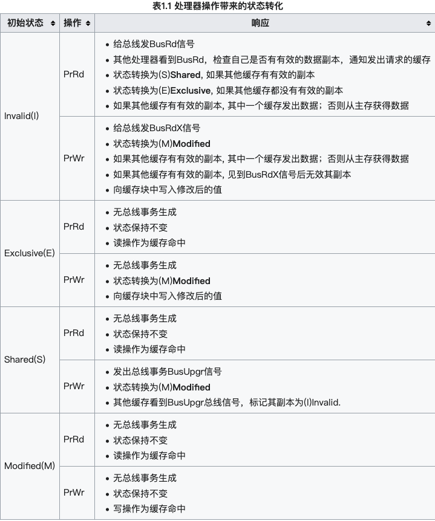
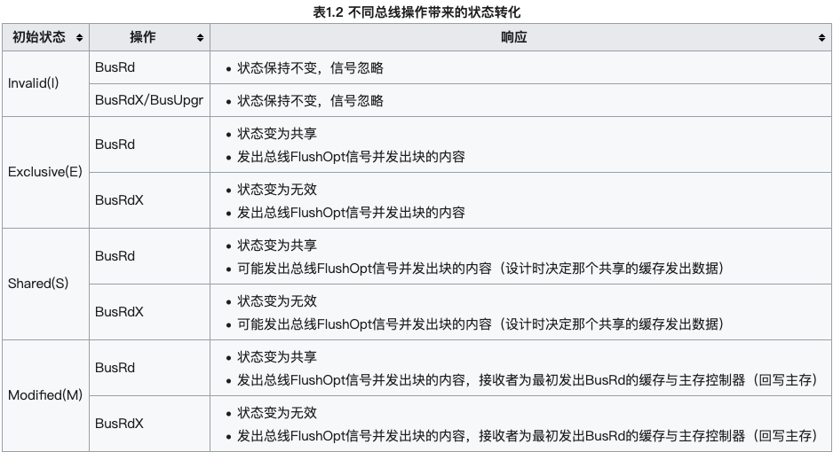

# volatile

在前面的文章并发问题的解决方案中，已经提过了volatile。

volatile用作保证变量的可见性和防止执行重排序，以达到一个线程修改数据后另一个线程立即可见，本文分析volatile时如何做到这一点的。

### volatile的汇编指令

(这个汇编指令我是没整出来，一个小小的class文件，按照晚上教程执行生成txt竟然有37M)

volatile关键字加或者不加主要区别在于，加了volatile关键字时，会多出一个lock前缀指令。

lock指令以前会锁总线，但是锁总线会使CPU无法访问内存，效率低下。

目前lock指定都是锁本CPU缓存，依靠缓存一致性协议保证操作的原子性。

lock前缀指定相当于一个内存屏障，内存屏障会提供3个功能：

1. 确保指令重排序时不会把屏障后面的指令排到内存屏障之前的位置，也不会把前面的指令排到内存屏障后面。
2. 强制将缓存的修改理解写入到内存
3. 如果是写操作，会导致其他CPU中对应的缓存行无效

### MESI缓存一致性协议

因为CPU中使用了缓存，使用缓存就会有缓存中数据和内存中不一致的情况。

解决缓存不一致问题有多种解决方案，其中一种就是MESI缓存一致性协议。

MESI的核心思想是：如果发现操作的变量是共享变量，即在其他CPU中也存在该变量的副本，会发出信号通知其他CPU将该变量的缓存行置为无效。

MESI分别代表CPU中缓存行的状态：

| 状态      | 描述                                                         |
| --------- | ------------------------------------------------------------ |
| Modified  | 当前cache的内容有效，数据已经被修改且与内存中数据不一致，数据只存在于当前cache中 |
| Exclusive | 当前cache的内容有效，数据与内存中数据一致，数据只存在于当前cache中 |
| Shared    | 当前cache的内容有效，数据与内存的数据一致，数据在多个cache里存在 |
| Invalid   | 当前cache无效                                                |

再来一份维基百科的状态说明：

| 状态      | 描述                                                         |
| --------- | ------------------------------------------------------------ |
| Modified  | 缓存行是脏的，与主存值不同。如果别的CPU内核要读取主存这块数据，该缓存行必须协会到主存，状态变为共享（S） |
| Exclusive | 缓存行只在当前缓存中，并且是干净的--缓存数据同于主存数据。当别的缓存读取它时，状态变为共享；当前写数据时，变为Modified状态。 |
| Shared    | 缓存行也存在于其他缓存中且是干净的。缓存行可以在任意时刻抛弃。 |
| Invalid   | 当前cache无效                                                |

MESI协议类似一个有限状态自动机，状态转换主要分两种场景：

* 缓存所在处理器的读写
  * PrRr：处理器请求读一个缓存块
  * PrWr：处理器请求写一个缓存块
* 其他处理器的读写
  * BusRd：窥探器请求指出其他处理器请求**读一个缓存块**
  * BusRdX：窥探器请求指出其他处理器请求**写一个该处理器不拥有的缓存块**
  * BusUpgr：窥探器请求指出其他处理器请求**写一个该处理器拥有的缓存块**
  * Flush：窥探器请求指出请求**回写整个缓存到主存**
  * FlushOpt：窥探器请求指出整个缓存块被发到总线以发送给另外一个处理器（缓存到缓存的复制）

继续搬运维基百科中MESI协议四种状态的轮换表。由于markdown对表格支持是在不好，直接贴图。

处理器操作带来的状态转化

不同总线操作带来的状态转化

对于MESI缓存一致性协议，可以进行如下总结：

1. 除了Invalid状态，其他状态的数据都是可以直接读取的。Invalid状态下，需要从内存中读取最新的数据。
2. 只有缓存行状态为Exclusive或者Modified时，才可以往缓存中写入数据
3. 对于Modified的缓存行，需要监听其他CPU对该数据的读请求，并将数据刷到主存
4. 对于Shared的缓存行，需要监听使其无效的的广播，将其变为Invalid状态
5. Exclusive可以看作是一种优化，因为是独占的，所以修改的时候不需要通知其它CPU

