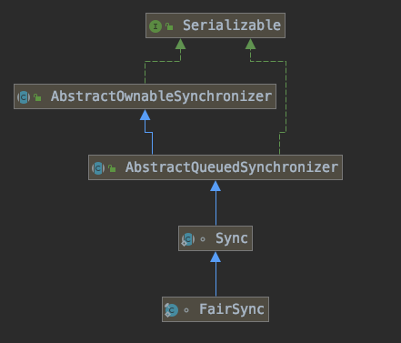

# AQS-1

AQS是AbstractQueuedSynchronized的缩写，翻译过来是**抽象排队同步器**，是java并发包的基础，ReentrantLock、CountDownLatch、Semphore等都是基于AQS实现的。

AQS也依据管程模型来的，所以再进行源码分析之前，请现在大脑里回想一下MESA管程模型吧。

首先根据JDK源码中的类介绍，来了解下AQS到底是干什么用的。

本篇文章通过ReentrantLock的lock和unlock来分析源码。

### AQS Java doc

AQS提供了一个依赖于FIFO队列实现阻塞锁和相关同步器的框架。该类主要是通过原子的state来实现大部分的同步器，子类通过getState、setState以及compareAndSetState实现自己的阻塞逻辑。

同时，当子类继承AQS时，推荐子类在内部定义帮助类，类似于ReentrantLock中的Sync。

AQS执行互斥同步的形式主要是以下两个方法：

````java
/**
 * Acquire:
 */
while (!tryAcquire(arg)) {
    // 如线程尚未排队，则对其进行排队
    // 可能阻塞当前线程
}

/**
 * Release:
 */
while (!tryRelease(arg)) {
    // 解除第一个排队线程的阻塞
}
````

AQS基于三个部分实现：

1. 支持原子操作的state
2. 一个排队队列Queue
3. LockSupport中部分方法

英文水平实在有限，文档翻译就到这里吧，接下来会贴一下Java doc中Doug Lea提到的例子

### AQS Examples

#### 不可重入的互斥锁

````java
/**
 * 不可重入的互斥锁，其中state==0代表无锁状态，state==1代表锁已经被持有
 */
class Mutex implements Lock, java.io.Serializable {
     // 内部辅助类
     private static class Sync extends AbstractQueuedSynchronizer {
     // 是否可以获取锁
     protected boolean isHeldExclusively() {
       return getState() == 1;
     }
     // 如果state==0尝试获取锁
     public boolean tryAcquire(int acquires) {
       // 断言下入参是不是1
       assert acquires == 1; 
       // CAS把0设置成1
       if (compareAndSetState(0, 1)) {
         // 成功之后把当前线程设置为互斥锁持有线程
         setExclusiveOwnerThread(Thread.currentThread());
         // CAS成功，竞争锁成功
         return true;
       }
       // CAS失败，也就是竞争锁失败
       return false;
     }
     // 释放锁，把state设置为0
     protected boolean tryRelease(int releases) {
       // 参数断言
       assert releases == 1; 
       // 如果已经无锁，抛异常
       if (getState() == 0) throw new IllegalMonitorStateException();
       // 将互斥锁持有线程设置为null
       setExclusiveOwnerThread(null);
       // 将state设置为0，后续线程才可以获取锁成功
       setState(0);
       // 释放锁成功
       return true;
     }
     // 条件变量
     Condition newCondition() { return new ConditionObject(); }
   }
   // Sync类实现了复杂的部分，所以互斥锁可以直接使用
   private final Sync sync = new Sync();
   public void lock()                { sync.acquire(1); }
   public boolean tryLock()          { return sync.tryAcquire(1); }
   public void unlock()              { sync.release(1); }
   public Condition newCondition()   { return sync.newCondition(); }
   public boolean isLocked()         { return sync.isHeldExclusively(); }
   public boolean hasQueuedThreads() { return sync.hasQueuedThreads(); }
   public void lockInterruptibly() throws InterruptedException {
     sync.acquireInterruptibly(1);
   }
   public boolean tryLock(long timeout, TimeUnit unit)
       throws InterruptedException {
     return sync.tryAcquireNanos(1, unit.toNanos(timeout));
   }
 }
}
````

#### 类似CountDownLatch的latch

````java
/**
 * 类似于CountDownLatch的门闩，因为门闩是非互斥的，多个线程可以同时访问，使用AQS共享模式
 * 当有信号到来时才会打开门闩
 */
class BooleanLatch {
  private static class Sync extends AbstractQueuedSynchronizer {
    // 是否有信号，不等于0时说明有信号
    boolean isSignalled() { return getState() != 0; }
    // 看看能不能从门闩通过
    protected int tryAcquireShared(int ignore) {
      return isSignalled() ? 1 : -1;
    }
    // 把门闩打开
    protected boolean tryReleaseShared(int ignore) {
      setState(1);
      return true;
    }
  }
  private final Sync sync = new Sync();
  public boolean isSignalled() { return sync.isSignalled(); }
  public void signal()         { sync.releaseShared(1); }
  public void await() throws InterruptedException {
    sync.acquireSharedInterruptibly(1);
  }
}}
````

通过这两个例子，我们可以大致了解AQS类的使用方法，无外乎两种：

1. 互斥同步模式
2. 共享模式

## 互斥同步模式

互斥共享模式是juc包中各种Lock所使用的，为了逻辑更加清晰，还是从实际使用中切入，通过ReentrantLock来看下是怎样利用AQS来做到资源的互斥访问的。

### AQS源码解析

先来贴一段ReentrantLock的使用代码：

````java
public static void main(String[] args) {
    ReentrantLock lock = new ReentrantLock();
    lock.lock();
    // do Something
    lock.unlock();
}
````

Lock.lock()调用的是ReentrantLock内部类的FairLock的方法，而FairLock最终调用的是AQS的acquire，先贴一下UML图。



AQS中的acquire到底做了什么？

```java
public final void acquire(int arg) {
    if (!tryAcquire(arg) &&
        acquireQueued(addWaiter(Node.EXCLUSIVE), arg))
        selfInterrupt();
}
```

#### 静态内部类-Node

在解决acquire方法之前，需要先来了解下AQS的静态内部类：Node。

在前文中也提到了，AQS实现的三个部分，其中LockSupport是基于Unsafe来做的，那么就剩下了两个重要部分：

* state
* 等待队列

`等待队列`就是有Node来实现的，可以说Node才是整个AQS的精华所在，让我们来撸一波代码。精华啊！！！！Doug Lea都在感谢人了。说明这个真的很屌。

```java
/**
 * 等待队列是CLH锁队列的一个变种，CLH锁通常被用作自旋锁。
 * 这里并不是使用CLH锁来作为同步器，而是使用了CLH锁的策略：在前驱节点持有当前线程的控制信息
 * 一个节点会在前驱节点释放时，得到抢锁的机会。
 * CLH、MCS【扩展阅读：https://coderbee.net/index.php/concurrent/20131115/577】
 * CLH队列中，入队将节点拼接到tail，出队则需要设置head
 *      +------+  prev +-----+       +-----+
 * head |      | <---- |     | <---- |     |  tail
 *      +------+       +-----+       +-----+
 * 
 * "prev"节点主要负责处理取消，如果一个节点取消了，他个后继节点要链接到一个没有取消的前驱节点
 * "next"节点用来实现阻塞机制。根据前驱节点的通知来唤醒自己，需要注意的是防止其他节点抢tail
 */
static final class Node {
    /** 标记表示节点以共享模式等待 */
    static final Node SHARED = new Node();
    /** 标记表示节点以独占模式等待 */
    static final Node EXCLUSIVE = null;

    /** 取消状态 */
    static final int CANCELLED =  1;
    /** 后继节点需要被unpark */
    static final int SIGNAL    = -1;
    /** thread在等待一个条件 */
    static final int CONDITION = -2;
    /**
     * 下一个获取共享要被无条件传播
     */
    static final int PROPAGATE = -3;

    /**
     * 等待状态字段：
     *   SIGNAL:     该节点的后继节点通过park已经阻塞了，当前节点释放或者取消时，需要通知后继节点unpark
     *							 为了避免竞争，acquire方法先表明需要一个信号，然后原子的抢锁。
     *   CANCELLED:  节点被超时或者中断所取消。
     *							 节点的取消状态不会改变，也不会再阻塞。
     *   CONDITION:  当前节点在一个条件的等待队列上。在被转移之前，不会被当作同步队列的节点。
     *   PROPAGATE:  
     *   0:          除了上面这些值，只会有个0
     *
     * waitStatus使用数字也是为了方便使用。
     * 非负数表示节点不需要发信号，所有大部分代码不需要检查特别的值
     *
     * 默认同步节点的初始值是0
     * 条件的初始值是-2
     *
     * 修改都是通过CAS来操作的
     */
    volatile int waitStatus;

    /**
     * 当前节点需要检查waitStatus的前驱节点。
     * 在入队的时候分配，出队的时候置为null。
     * 一个节点只有在成功acquire之后变成head节点。
     * 节点被取消之后永远不会成功抢到锁，而且线程只能被自己取消，而不是其他node
     */
    volatile Node prev;

    /**
     * 连接一个需要被当前节点唤醒的后继节点。
     * 需要注意的是，next==null不一定代表当前节点是tail，这个时候还要从tail做双重检查
     */
    volatile Node next;

    /**
     * node里面持有的线程
     */
    volatile Thread thread;

    /**
     * 连接到条件上的下一个节点，或者是一个特殊的值：SHARED
     * 形成一个条件队列，一个node一个node的串起来
     */
    Node nextWaiter;

    /**
     * Returns true if node is waiting in shared mode.
     */
    final boolean isShared() {
        return nextWaiter == SHARED;
    }

    /**
     * 返回当前节点的前驱节点
     */
    final Node predecessor() throws NullPointerException {
        Node p = prev;
        if (p == null)
            throw new NullPointerException();
        else
            return p;
    }

    Node() {
    }

    // Used by addWaiter
    Node(Thread thread, Node mode) {     
        this.nextWaiter = mode;
        this.thread = thread;
    }
    
    // Used by Condition
    Node(Thread thread, int waitStatus) { 
        this.waitStatus = waitStatus;
        this.thread = thread;
    }
}
```

#### AQS-成员变量

```java
/**
 * 等待队列的头部，懒加载。
 * 除了初始化，也可以通过setHead方法修改。
 * 注意：如果head存在，他的waitStatus保证不会为CANCELLED。
 */
private transient volatile Node head;

/**
 * 等待队列的尾部，懒加载。
 * 通过enq来增加新的等待节点。
 */
private transient volatile Node tail;

/**
 * 同步状态
 */
private volatile int state;
```

看到这三个成员变量，大概可以猜测出lock的流程，不管咋说，自己先懵一个，然后看看和大佬的思路出入在什么地方：

1. state字段用于判断当前锁能不能直接用，最初应该是0，有人拿到锁就加1，重入再加1
2. head和tail用于组成阻塞队列，入队后连在tail后面，prev节点释放会unpark successor节点
3. 设置state和往队列的tail上连都需要进行CAS

#### 回到lock方法

> 注意：以下代码分析都是基于ReentrantLock中的FairSync来进行的，读者自己跟源码要注意下。

FairSync的加锁方法如下：

```java
final void lock() {
    acquire(1);
}
```

继续往里面跟：

```java
/**
 * 以独占模式获取
 * 粗略看一下，两个条件会继续执行acquire(1)后面的方法，也就是获取到锁了
 * 1.tryAcquire(arg)返回true，也就是获取锁成功
 * 2.tryAcquire(arg)返回false，acquireQueued(addWaiter(Node.EXCLUSIVE, arg))返回false
 * 
 * 为啥不想让代码进selfInterrupt()呢？
 * 因为点进去发现里面是 Thread.currentThread().interrupt();显然不是正常流程，我来获取锁，你给我来个中断？
 */ 
public final void acquire(int arg) {
    if (!tryAcquire(arg) &&
        acquireQueued(addWaiter(Node.EXCLUSIVE), arg))
        selfInterrupt();
}
```

先瞅瞅`tryAcquire(1)`是怎么来先抢锁的吧！

```java
/**
 * 尝试获取锁的公平版本
 * 有机会尝试的条件是：递归、没有等待者、当前为第一个等待者
 */
protected final boolean tryAcquire(int acquires) {
    // 获取当前线程
    final Thread current = Thread.currentThread();
    // 获取AQS的state
    int c = getState();
    // state == 0，说明现在锁是空闲的，可用的
    if (c == 0) {
        // 这里包含两个方法，抢锁成功必须同时成功：
        // 1.hasQueuedPredecessors()，看是否有人排在自己前面，有的话直接失败
      	// 2.compareAndSetState(0, acquires)，CAS设置state的值，设置成功即抢锁成功，否则就是失败
      	
      	// 成功获取锁的条件就是：锁可以抢 -> 前面没人 -> 自己抢到了 -> 设置独占锁的线程(重入用)
        if (!hasQueuedPredecessors() &&
            compareAndSetState(0, acquires)) {
            setExclusiveOwnerThread(current);
            return true;
        }
    }
  	// state != 0,说明现在锁不空闲，不能抢
  	// 这时候看下当前锁的独占线程是不是自己，是自己的话就重入，不是自己的话，就是尝试抢锁失败
  	// 这里只会有一个线程访问，不需要CAS
    else if (current == getExclusiveOwnerThread()) {
        int nextc = c + acquires;
        if (nextc < 0)
            throw new Error("Maximum lock count exceeded");
        setState(nextc);
        return true;
    }
    return false;
}

// 公平锁排队问题
// 既然是公平锁，看看检查是否有人排在自己前面是咋做的，`hasQueuedPredecessors`
public final boolean hasQueuedPredecessors() {
    // 返回true说明有人排队，返回false说明没人排队，或者自己就是对头
  	// false又分为3种情况：
  	// 1.head == tail，头节点 == 尾节点，那肯定是没人排队，否则就是起来前两个节点是有人排的
  	// 2.有人排队：(s = h.next) == null，说明head后面没有节点
  	// 3.有人排队：当前线程所在节点不是head紧后面的节点
  	// 2 + 3 同时为false，才是没人排队，也就是head后面节点不为空，切head后面节点中线程不是当前线程
    Node t = tail;
    Node h = head;
    Node s;
    return h != t &&
        ((s = h.next) == null || s.thread != Thread.currentThread());
}
```

上面的步骤完成了对state的判断，是否能成功获取到锁。如果尝试获取锁失败了，那就需要进入阻塞队列了：

`acquireQueued(addWaiter(Node.EXCLUSIVE), arg)`，先执行addWaiter(Node.EXCLUSIVE)

```java
/**
 * 传入参数为mode，将当前线程包装成一个node并入队
 */
private Node addWaiter(Node mode) {
  	// 当前线程构造成一个Node
    Node node = new Node(Thread.currentThread(), mode);
    // 先尝试CAS快速入队，入队失败走enq(node)入队
    Node pred = tail;
    if (pred != null) {
      	// CAS没啥好说的
        node.prev = pred;
        if (compareAndSetTail(pred, node)) {
            pred.next = node;
            return node;
        }
    }
  	// 入队
    enq(node);
  	// 返回当前线程构造出来，并且已经入队的node
    return node;
}

/**
  * 入队
  * 如果没有初始化，执行初始化
  *      +------+  prev +-----+       +-----+
  * head |      | <---- |     | <---- |     |  tail
  *      +------+       +-----+       +-----+
  */
private Node enq(final Node node) {
   // 自旋
   for (;;) {
     	// 获取tail节点
      Node t = tail;
      if (t == null) {
        // tail节点为空，必须进行初始化
        // CAS设置head节点为new Node()
        // tail和head节点设置为一样的值
        // 下一次自旋，这里可以保证只会有一个head
        if (compareAndSetHead(new Node()))
          tail = head;
      } else {
        // 到了这里说明tail不为空，需要把当前节点CAS设置为新的tail
        node.prev = t;
        if (compareAndSetTail(t, node)) {
          t.next = node;
          return t;
        }
      }
   }
}
```

执行完上面的`addWaiter()`之后，当前线程就在阻塞队列里面排队了，并且`返回值是当前线程的node`，继续执行`acquireQueued()`

```java
/**
 * 这个方法是获取锁失败要执行的，如果返回值为true，就会执行selfInterrupt()，所以理论上是会返回false
 * 这个方法很重要，是线程挂起的关键所在，被唤醒之后也是继续从这个方法的代码执行
 * 
 * @param 刚才入队成功的node
 * @param 1
 * @return {@code true} 如果在等待中发生了中断，返回true
 */
final boolean acquireQueued(final Node node, int arg) {
    boolean failed = true;
    try {
        boolean interrupted = false;
      	// 自旋
        for (;;) {
          	// 获取刚入队节点的前置节点
            final Node p = node.predecessor();
          	// 前置节点为head，短路与，可以尝试一波获取锁，通过tryAcquire(arg)来试一波抢锁
            if (p == head && tryAcquire(arg)) {
                setHead(node);
                p.next = null; // help GC
                failed = false;
                return interrupted;
            }
          	// 不能直接获取锁，那还是去park住当前线程，来进行排队吧
          	// shouldParkAfterFailedAcquire(p, node)，p是刚入队节点的前驱节点，node是刚入队节点，方法详解见下
          	// parkAndCheckInterrupt()，这里面就是真正的park了
            if (shouldParkAfterFailedAcquire(p, node) &&
                parkAndCheckInterrupt())
                interrupted = true;
        }
    } finally {
      	
        if (failed)
            cancelAcquire(node);
    }
}

/**
 * 为抢锁失败的节点校验和更新状态
 * 返回true：线程需要被阻塞
 * 这是控制所有抢锁的主要通知（狗屁不通，反正很重要就是了）
 */
private static boolean shouldParkAfterFailedAcquire(Node pred, Node node) {
  	// 前一个节点的waitStatus
    int ws = pred.waitStatus;
  	
    if (ws == Node.SIGNAL)
      	// 前驱节点的状态是SIGNAL，说明前驱节点状态正常，当前节点可以放心park
      	return true;
    if (ws > 0) {
      	// ws > 0说明：前驱节点已经是取消状态了
      	// 所以当前节点要一直往前找，知道找到一个可以用的前驱节点，也就是能通知自己的前驱节点
      	do {
        	node.prev = pred = pred.prev;
      	} while (pred.waitStatus > 0);
      	pred.next = node;
    } else {
     		// 到这里说明前驱节点状态为：0、-2、-3
      	// 因为节点new Node()时，waitStatus == 0，所以这里把前置节点设置为SIGNAL
      	// 前驱节点设置为SIGNAL，才能通知自己
      	compareAndSetWaitStatus(pred, ws, Node.SIGNAL);
    }
    return false;
}

/**
 * 如果shouldParkAfterFailedAcquire()成功，执行park，让当前线程park住
 * 当前类为：AQS
 */
private final boolean parkAndCheckInterrupt() {
  	// this是啥？ - this是AQS实例啊
  	LockSupport.park(this);
  	// 当线程被unpark之后，会继续执行下面的代码，判断在被park期间，有没有发生中断，并把中断标示clear
  	return Thread.interrupted();
}

/**
 * LockSupport.park(Object obj)
 * 用当前实例来park当前线程
 * 当前线程被unpark之后，回继续执行setBlocker(t, null);
 */
public static void park(Object blocker) {
    Thread t = Thread.currentThread();
    setBlocker(t, blocker);
    UNSAFE.park(false, 0L);
    setBlocker(t, null);
}
```

到这里，加锁逻辑就分析完了，总结一下FairLock的加锁步骤：

1. 先看state，CAS成功就是获取锁成功
2. CAS失败后，把当前线程包装成node，连到等待队列的tail上
3. 连接到tail上之后，park住当前线程

```java
/**
 * 再贴一波入口代码！！！！！
 * 看完上面细节，记着再从头走一遍
 */
public final void acquire(long arg) {
    if (!tryAcquire(arg) &&
        acquireQueued(addWaiter(Node.EXCLUSIVE), arg))
        selfInterrupt();
}
```

#### 再看unlock方法

lock看完，就看unlock方法，理论上unlock就是释放当前锁，通知下一个节点。下面是ReentrantLock的unlock方法：

```java
public void unlock() {
    sync.release(1);
}
```

跟进跟进，继续往里：

```java
public final boolean release(int arg) {
  	// tryRelease就是尝试释放的意思啊，里面就是对state进行减1，没啥特殊操作
    if (tryRelease(arg)) {
      	// 释放成功，找到head节点，同时它的后继节点
        Node h = head;
        if (h != null && h.waitStatus != 0)
          	// 重点来了，unpark后继节点，传入的参数是head节点
            unparkSuccessor(h);
      	// 执行完之后说明解锁成功
        return true;
    }
  	// 减1都失败了，肯定解锁失败了
    return false;
}

protected final boolean tryRelease(int releases) {
  	// 先算一下，当前state减完是几
    int c = getState() - releases;
  	// 不是持有锁的线程来release，直接抛异常出来
    if (Thread.currentThread() != getExclusiveOwnerThread())
        throw new IllegalMonitorStateException();
    boolean free = false;
  	// 看下state到0没有，没到0说明还有重入锁
    if (c == 0) {
      	// 减到0了，说明锁可以被其他线程获取了
        free = true;
      	// 把独占锁的线程给置为null
        setExclusiveOwnerThread(null);
    }
  	// 没到0，把剪完的state设置一下子，free还是false
    setState(c);
    return free;
}

private void unparkSuccessor(Node node) {
    // 获取head的waitStatus
    int ws = node.waitStatus;
    if (ws < 0)
        compareAndSetWaitStatus(node, ws, 0);

    // 从队尾开始往前找，waitStatus<=0的所有节点排在最前面的
    Node s = node.next;
    if (s == null || s.waitStatus > 0) {
        s = null;
        for (Node t = tail; t != null && t != node; t = t.prev)
            if (t.waitStatus <= 0)
                s = t;
    }
  	// s不为空，unpark节点里面的thread
    if (s != null)
        LockSupport.unpark(s.thread);
}
```

到这里为止，我们通过ReentrantLock分析了一波AQS，从细节上了解了ReentrantLock的加锁和解锁是如何实现的。

弄懂ReentrantLock对与AQS的使用后，就可以进入下一步旅程了，看看其他juc里面的工具是如何使用AQS来实现自己的目的的。

ReentrantLock相当于掌握了80%，后面就来分析一下剩余的20%—Condition。