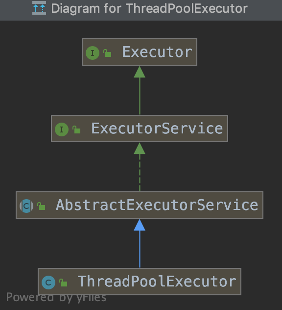
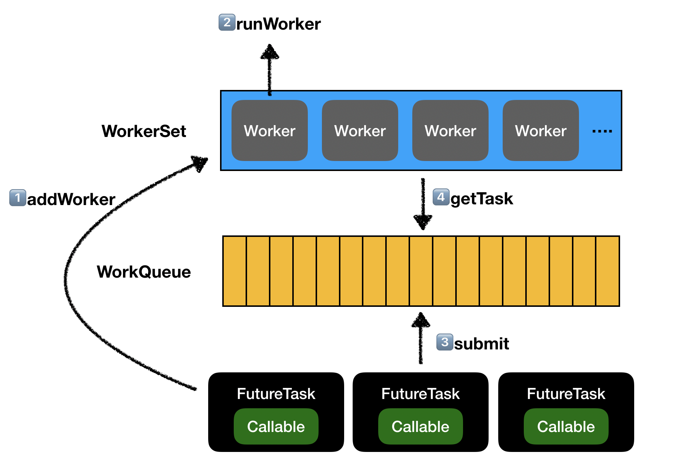

# 线程池

要了解线程池，就先要了解一下线程池的生命周期。

### 线程池的状态

* RUNNING：这个没什么好说的，这是最正常的状态：接受新的任务，处理等待队列中的任务

* SHUTDOWN：不接受新的任务提交，但是会继续处理等待队列中的任务

* STOP：不接受新的任务提交，不再处理等待队列中的任务，中断正在执行任务的线程

* TIDYING(整理)：所有的任务都销毁了，workCount 为 0。线程池的状态在转换为 TIDYING 状态时，会执行钩子方法 terminated()

* TERMINATED：terminated() 方法结束后，线程池的状态就会变成这个

> RUNNING 定义为 -1，SHUTDOWN 定义为 0，其他的都比 0 大，所以等于 0 的时候不能提交任务，大于 0 的话，连正在执行的任务也需要中断。

### 线程池的状态流转

* RUNNING -> SHUTDOWN：当调用了 shutdown() 后，会发生这个状态转换，这也是最重要的

* (RUNNING or SHUTDOWN) -> STOP：当调用 shutdownNow() 后，会发生这个状态转换，这下要清楚 shutDown() 和 shutDownNow() 的区别了

* SHUTDOWN -> TIDYING：当任务队列和线程池都清空后，会由 SHUTDOWN 转换为 TIDYING

* STOP -> TIDYING：当任务队列清空后，发生这个转换

* TIDYING -> TERMINATED：这个前面说了，当 terminated() 方法结束后

### Example

下面先看一下平时是怎么使用线程池的，通过一个小例子来重温一下：

```java
public class ThreadPoolExample {
    
    public static void main(String[] args) {
        ExecutorService threadPool = Executors.newFixedThreadPool(5);
        for(int i=0; i<10; i++){
            threadPool.submit(() -> System.out.println(Thread.currentThread().getName() + ": execute test!"));
        }
    }
    
}

输出结果：
pool-1-thread-1: execute test!
pool-1-thread-4: execute test!
pool-1-thread-3: execute test!
pool-1-thread-2: execute test!
pool-1-thread-4: execute test!
pool-1-thread-4: execute test!
pool-1-thread-3: execute test!
pool-1-thread-1: execute test!
pool-1-thread-5: execute test!
pool-1-thread-2: execute test!
```

我们可以看到，输出结果中存在pool-1-thread-?，但是？的值最大为5，刚好对应我们在创建线程池时指定的`newFixedThreadPool(5)`，通过submit来提交任务，线程池会自己调度任务的执行。

那么，执行`newFixedThreadPool(5)`的时候到底创建了一个什么样的对象呢？让我们来一探究竟。

### 从`newFixedThreadPool(5)`开始说起

`Executors`是我们常用的一个工具类，类似于`Arrays`，我们在这里先不做过多关注，直接看下创建线程池的代码：

```java
public static ExecutorService newFixedThreadPool(int nThreads) {
    return new ThreadPoolExecutor(nThreads, nThreads,
                                  0L, TimeUnit.MILLISECONDS,
                                  new LinkedBlockingQueue<Runnable>());
}

// 往里走
public ThreadPoolExecutor(int corePoolSize,
                          int maximumPoolSize,
                          long keepAliveTime,
                          TimeUnit unit,
                          BlockingQueue<Runnable> workQueue) {
    this(corePoolSize, maximumPoolSize, keepAliveTime, unit, workQueue,
         Executors.defaultThreadFactory(), defaultHandler);
}

// 再往里走
public ThreadPoolExecutor(int corePoolSize,
                          int maximumPoolSize,
                          long keepAliveTime,
                          TimeUnit unit,
                          BlockingQueue<Runnable> workQueue,
                          ThreadFactory threadFactory,
                          RejectedExecutionHandler handler) {
    if (corePoolSize < 0 ||
        maximumPoolSize <= 0 ||
        maximumPoolSize < corePoolSize ||
        keepAliveTime < 0)
        throw new IllegalArgumentException();
    if (workQueue == null || threadFactory == null || handler == null)
        throw new NullPointerException();
    this.acc = System.getSecurityManager() == null ?
            null :
            AccessController.getContext();
    this.corePoolSize = corePoolSize;
    this.maximumPoolSize = maximumPoolSize;
    this.workQueue = workQueue;
    this.keepAliveTime = unit.toNanos(keepAliveTime);
    this.threadFactory = threadFactory;
    this.handler = handler;
}
```

可以看到，通过`Executors.newFixedThreadPool(5)`创建了一个`ThreadPoolExecutor`对象（参数一会就会说到）

ThreadPoolExecutor的类关系图如下，我们从最顶上的Executor开始分析，如果创建一个线程池并且提交和执行任务的。



### Executor

```java
public interface Executor {

    /**
     * 在未来某时执行给定的任务。
     * 针对不同的实现，任务可能会在一个新线程执行，也可能使用一个已经在池中的线程，或者当前调用线程。
     */
    void execute(Runnable command);
}
```

Executor接口很简单，只有一个方法，就是执行任务方法。在juc下有一个接口继承他，就是图中的`ExecutorService`。

### ExecutorService

```java
/**
 * ExecutorService继承接口Executor，是对Executor的扩展
 * 除了执行任务的executor方法，还扩展了三类方法：
 * 关闭类：shutdown，线程池拒绝接收新任务、不执行已提交任务、完全停止线程池等
 * 提交类：submit，支持Future的提交，提交Callable和Runnable
 * 执行类：invoke，各种执行，invokeAny，invokeAll等
 */
public interface ExecutorService extends Executor {

    /**
     * 不接收新的任务，会处理已提交任务
     */
    void shutdown();

    /**
     * 不接收新的任务，不处理已提交的任务
     */
    List<Runnable> shutdownNow();

    /**
     * 判断是否已经shutdown
     */
    boolean isShutdown();

    /**
     * 判断是否已经treminate
     */
    boolean isTerminated();

    /**
     * 阻塞等待shutdown，如果规定时间未shutdown，则强制Terminate
     */
    boolean awaitTermination(long timeout, TimeUnit unit)
        throws InterruptedException;

    /**
     * 提交一个Callable类型的任务，会有一个Future供获取结果
     */
    <T> Future<T> submit(Callable<T> task);

    /**
     * 提交一个Runnbale类型任务，和一个显式的结果，返回Future
     */
    <T> Future<T> submit(Runnable task, T result);

    /**
     * 提交一个简单的Runnable任务
     */
    Future<?> submit(Runnable task);

    /**
     * 执行所有任务
     */
    <T> List<Future<T>> invokeAll(Collection<? extends Callable<T>> tasks)
        throws InterruptedException;

    /**
     * 执行所有任务，带超时时间
     */
    <T> List<Future<T>> invokeAll(Collection<? extends Callable<T>> tasks,
                                  long timeout, TimeUnit unit)
        throws InterruptedException;

    /**
     * 执行任何一个任务
     */
    <T> T invokeAny(Collection<? extends Callable<T>> tasks)
        throws InterruptedException, ExecutionException;

    /**
     * 执行任何一个任务，带超时时间
     */
    <T> T invokeAny(Collection<? extends Callable<T>> tasks,
                    long timeout, TimeUnit unit)
        throws InterruptedException, ExecutionException, TimeoutException;
}
```

看完`Executor`的接口，是不是觉得这个东西有点像线程池了？

这里，引入了两个新的概念`Callable`和`Future`，先简单介绍下两个概念：

* Future：异步执行的结果，通常用于`Executor.execute(FutureTask)`或者`Executor.sumbit(Callable)`的返回值。Future中定义了五个接口，主要用于获取结果，判断异步计算是否完成，以及取消异步任务。
* Callable：`Callable`可以理解为带返回值的`Runnable`。

然后我们看下类图中ExecutorService的实现类：AbstractExecutorService。

### AbstractExecutorService

打开`AbstractExecutorService`，可以看到第一个方法就是：`newTaskFor`。

```java
/**
 * 针对Runnable的包装
 */
protected <T> RunnableFuture<T> newTaskFor(Runnable runnable, T value) {
    return new FutureTask<T>(runnable, value);
}

/**
 * 针对Callable的包装
 */
protected <T> RunnableFuture<T> newTaskFor(Callable<T> callable) {
    return new FutureTask<T>(callable);
}
```

先来分析一波FutureTask是干啥的。详见文章[FutureTask](FutureTask.md)。

现在，我们知道FutureTask是对Callable的一个封装，可以实现异步获取结果。

继续往下看看源代码，`AbstractExecutorService`既然是ExecutorService的抽象实现类，那么如何实现submit，invoke方法的？（在这我们先不关心取消类型的方法）。

#### sumbit方法实现

```java
/**
 * 提交一个Runnable任务
 */
public Future<?> submit(Runnable task) {
    if (task == null) throw new NullPointerException();
  	// 把Runnable包装成RunnableFuture
    RunnableFuture<Void> ftask = newTaskFor(task, null);
  	// 执行FutureTask
    execute(ftask);
    return ftask;
}

/**
 * 提交一个Runnable任务，并且🉑️返回结果result
 */
public <T> Future<T> submit(Runnable task, T result) {
    if (task == null) throw new NullPointerException();
    // 把Runnable和result包装成RunnableFuture
    RunnableFuture<T> ftask = newTaskFor(task, result);
  	// 执行FutureTask
    execute(ftask);
    return ftask;
}

/**
 * 提交一个Callable任务
 */
public <T> Future<T> submit(Callable<T> task) {
    if (task == null) throw new NullPointerException();
  	// 把Callable包装成RunnableFuture
    RunnableFuture<T> ftask = newTaskFor(task);
  	// 执行FutureTask
    execute(ftask);
    return ftask;
}
```

源码中`execute(ftask)`调用的是`Executor`的方法，是需要实现的。

> 注意：这里传入的是`RunnableFuture`，而不是`Runnable`。`execute`的实际上是`FutureTask`。

现在我们只关心`ThreadPoolExecutor`是如何实现的（其他实现还有`ForkJoinPool`等）。

这个方法我们先不做分析，我们先把AbstractExecutorService的方法看完，然后再深入了解`ThreadPoolExecutor`。

#### invoke方法实现

invoke方法的实现分为两种：invokeAny和invokeAll，这个源码有点绕，先记一个TODO

```java
/**
 * 执行task集合中任意task
 */
public <T> T invokeAny(Collection<? extends Callable<T>> tasks)
    throws InterruptedException, ExecutionException {
    try {
        return doInvokeAny(tasks, false, 0);
    } catch (TimeoutException cannotHappen) {
        assert false;
        return null;
    }
}

/**
 * 执行task集合中任意task，带超时时间
 */
public <T> T invokeAny(Collection<? extends Callable<T>> tasks,
                       long timeout, TimeUnit unit)
    throws InterruptedException, ExecutionException, TimeoutException {
    return doInvokeAny(tasks, true, unit.toNanos(timeout));
}

/**
 * invokeAny的主要方法
 */
private <T> T doInvokeAny(Collection<? extends Callable<T>> tasks,
                          boolean timed, long nanos)
    throws InterruptedException, ExecutionException, TimeoutException {
  	// tasks不能为空
    if (tasks == null)
        throw new NullPointerException();
    int ntasks = tasks.size();
  	// tasks任务数不能为0
    if (ntasks == 0)
        throw new IllegalArgumentException();
    ArrayList<Future<T>> futures = new ArrayList<Future<T>>(ntasks);
    ExecutorCompletionService<T> ecs =
        new ExecutorCompletionService<T>(this);

    try {
        // Record exceptions so that if we fail to obtain any
        // result, we can throw the last exception we got.
        ExecutionException ee = null;
        final long deadline = timed ? System.nanoTime() + nanos : 0L;
        Iterator<? extends Callable<T>> it = tasks.iterator();

        // Start one task for sure; the rest incrementally
        futures.add(ecs.submit(it.next()));
        --ntasks;
        int active = 1;

        for (;;) {
            Future<T> f = ecs.poll();
            if (f == null) {
                if (ntasks > 0) {
                    --ntasks;
                    futures.add(ecs.submit(it.next()));
                    ++active;
                }
                else if (active == 0)
                    break;
                else if (timed) {
                    f = ecs.poll(nanos, TimeUnit.NANOSECONDS);
                    if (f == null)
                        throw new TimeoutException();
                    nanos = deadline - System.nanoTime();
                }
                else
                    f = ecs.take();
            }
            if (f != null) {
                --active;
                try {
                    return f.get();
                } catch (ExecutionException eex) {
                    ee = eex;
                } catch (RuntimeException rex) {
                    ee = new ExecutionException(rex);
                }
            }
        }

        if (ee == null)
            ee = new ExecutionException();
        throw ee;

    } finally {
        for (int i = 0, size = futures.size(); i < size; i++)
            futures.get(i).cancel(true);
    }
}
```

这里只展示了invokeAny方法，我们发现获取到task之后，调用的是submit方法。

而submit方法内部都是使用executor方法来执行任务的。

所以我们的重点还是executor方法。下面一起探究下`ThreadPoolExecutor`。

### ThreadPoolExecutor

`ThreadPoolExecutor`是JDK中线程池的实现，这个类实现了线程池的很多方法：任务提交、线程管理、监控等等。

在第一部分，我们通过`newFixedThreadPool(5)`创建了一个线程池，底层调用的是：

```java
public ThreadPoolExecutor(int corePoolSize,
                          int maximumPoolSize,
                          long keepAliveTime,
                          TimeUnit unit,
                          BlockingQueue<Runnable> workQueue,
                          ThreadFactory threadFactory,
                          RejectedExecutionHandler handler) {
    if (corePoolSize < 0 ||
        maximumPoolSize <= 0 ||
        maximumPoolSize < corePoolSize ||
        keepAliveTime < 0)
        throw new IllegalArgumentException();
    if (workQueue == null || threadFactory == null || handler == null)
        throw new NullPointerException();
    this.acc = System.getSecurityManager() == null ?
            null :
            AccessController.getContext();
    this.corePoolSize = corePoolSize;
    this.maximumPoolSize = maximumPoolSize;
    this.workQueue = workQueue;
    this.keepAliveTime = unit.toNanos(keepAliveTime);
    this.threadFactory = threadFactory;
    this.handler = handler;
}
```

下面来逐个说下方法的入参，这些入参也就对应着线程池的属性：

* corePoolSize：核心线程数
* maximumPoolSize：最大线程数
* keepAliveTime：空闲线程的存活时间，当超过这个时间没有给线程分配任务，线程就会关闭。但是不是所有的线程都会关闭，如果当前线程数小于等于核心线程数，那么不会关闭线程。可以通过调用`allowCoreThreadTimeOut(true)`使核心线程数内的线程也可以被回收。
* workQueue：任务队列，需要时BlockingQueue的某个实现
* threadFactory：用于生成线程的工厂，可以设置线程的名字
* handler：拒绝策略，当线程池不能再接受任务时，执行的方法，一般需要自己实现

#### 成员变量

除了上面创建线程池时的参数，还有一些成员变量，先来看看成员变量都是干啥的。

```java
/**
 * 线程池的主要控制state，包含两个部分
 *   workerCount, 有效的工作线程
 *   runState,    线程的工作状态
 * 
 * runState的状态有如下几个，在文章开头处有过介绍，这里可以对照英文再理解一下。
 *   RUNNING:  Accept new tasks and process queued tasks
 *   SHUTDOWN: Don't accept new tasks, but process queued tasks
 *   STOP:     Don't accept new tasks, don't process queued tasks,
 *             and interrupt in-progress tasks
 *   TIDYING:  All tasks have terminated, workerCount is zero,
 *             the thread transitioning to state TIDYING
 *             will run the terminated() hook method
 *   TERMINATED: terminated() has completed
 *
 * 线程的状态转换：
 * RUNNING -> SHUTDOWN
 *    On invocation of shutdown(), perhaps implicitly in finalize()
 * (RUNNING or SHUTDOWN) -> STOP
 *    On invocation of shutdownNow()
 * SHUTDOWN -> TIDYING
 *    When both queue and pool are empty
 * STOP -> TIDYING
 *    When pool is empty
 * TIDYING -> TERMINATED
 *    When the terminated() hook method has completed
 */
private final AtomicInteger ctl = new AtomicInteger(ctlOf(RUNNING, 0));

// 这里 COUNT_BITS 设置为 29(32-3)，意味着前三位用于存放线程状态，后29位用于存放线程数
// 很多初学者很喜欢在自己的代码中写很多 29 这种数字，或者某个特殊的字符串，然后分布在各个地方，这是非常糟糕的
private static final int COUNT_BITS = Integer.SIZE - 3;

// CAPACITY 容量设置为 000 11111111111111111111111111111
// 这里得到的是 29 个 1，也就是说线程池的最大线程数是 2^29-1=536870911
// 以我们现在计算机的实际情况，这个数量还是够用的
private static final int CAPACITY   = (1 << COUNT_BITS) - 1;

// 各个状态对应的值
// 111 00000000000000000000000000000
private static final int RUNNING    = -1 << COUNT_BITS;
// 000 00000000000000000000000000000
private static final int SHUTDOWN   =  0 << COUNT_BITS;
// 001 00000000000000000000000000000
private static final int STOP       =  1 << COUNT_BITS;
// 010 00000000000000000000000000000
private static final int TIDYING    =  2 << COUNT_BITS;
// 011 00000000000000000000000000000
private static final int TERMINATED =  3 << COUNT_BITS;

// 获取runState，线程池状态
private static int runStateOf(int c)     { return c & ~CAPACITY; }
// 获取workCount，线程池中的线程数
private static int workerCountOf(int c)  { return c & CAPACITY; }
// ctl值
private static int ctlOf(int rs, int wc) { return rs | wc; }

/*
 * 判断线程池状态是否小于某个值
 */
private static boolean runStateLessThan(int c, int s) {
    return c < s;
}

/*
 * 判断线程池状态是否大于等于某个值
 */
private static boolean runStateAtLeast(int c, int s) {
    return c >= s;
}

/*
 * 判断线程池状态是否在运行
 */
private static boolean isRunning(int c) {
    return c < SHUTDOWN;
}

/**
 * 一把锁
 */
private final ReentrantLock mainLock = new ReentrantLock();

/**
 * 工作线程的set，只有获取mainLock之后才可以访问
 */
private final HashSet<Worker> workers = new HashSet<Worker>();

/**
 * 一个基于mainLock的条件，用于终止线程池
 */
private final Condition termination = mainLock.newCondition();

/**
 * 线程池的曾经最大的大小
 */
private int largestPoolSize;

/**
 * 线程池完成任务的数量
 */
private long completedTaskCount;
```

上面这些基本上涵盖了线程池的所有成员变量。但是还有一个重要的属性，就是Worker。

#### Worker

ThreadPoolEcecutor中的Worker是AQS的子类，同时还实现了Runnable接口

```java
private final class Worker
    extends AbstractQueuedSynchronizer
    implements Runnable
{
    /** work运行的线程 */
    final Thread thread;
    /** 初始化需要执行的任务 */
    Runnable firstTask;
    /** 当前Worker完成的任务 */
    volatile long completedTasks;

    /**
     * 根据Runnable创建一个任务
     */
    Worker(Runnable firstTask) {
      	// inhibit interrupts until runWorker
        setState(-1); 
        this.firstTask = firstTask;
      	// new一个新的线程，这个线程包装了Worker
        this.thread = getThreadFactory().newThread(this);
    }

    /** run方法，交给外部调用的  */
    public void run() {
        runWorker(this);
    }

    protected boolean isHeldExclusively() {
        return getState() != 0;
    }

    protected boolean tryAcquire(int unused) {
        if (compareAndSetState(0, 1)) {
            setExclusiveOwnerThread(Thread.currentThread());
            return true;
        }
        return false;
    }

    protected boolean tryRelease(int unused) {
        setExclusiveOwnerThread(null);
        setState(0);
        return true;
    }

    public void lock()        { acquire(1); }
    public boolean tryLock()  { return tryAcquire(1); }
    public void unlock()      { release(1); }
    public boolean isLocked() { return isHeldExclusively(); }

    void interruptIfStarted() {
        Thread t;
        if (getState() >= 0 && (t = thread) != null && !t.isInterrupted()) {
            try {
                t.interrupt();
            } catch (SecurityException ignore) {
            }
        }
    }
}
```

Worker是线程池中真正工作的“工人”，通过实现Runnable方法，来执行`runWorker(this)`。

>  这里提出一个问题，为什么Worker要继承AQS呢？

#### executor

进行了这么多铺垫，让我们来看看提交一个FutureTask到线程池之后，到底发生了什么吧。

```java
/**
 * 在未来某个时刻执行任务，任务可能被新线程执行，也可能被已有线程执行
 *
 * 如果一个任务不能被执行，会被拒绝策略处理
 */
public void execute(Runnable command) {
    if (command == null)
        throw new NullPointerException();
    /**
     * Proceed in 3 steps:
     *
     * 1.如果运行线程数比核心线程数少，以给定的命令作为第一个任务创建一个新的线程。
     *   调用addWorker方法会自动检测运行状态和工作线程数，不会造成假的报警
     *
     * 2.如果一个任务已成功排队，仍需要二次检查是否需要增加一个线程或者线程池已经被关闭了。
     *   所以需要重新检查是否需要回滚入队，或者需要创建一个新的线程
     * 
     * 3.如果无法入队，我们尝试创建一个新的线程，如果失败则说明要么已经shutdown，要么已经饱和，所以执行拒绝策略
     */
  
  	// 获取ctl
    int c = ctl.get();
    if (workerCountOf(c) < corePoolSize) {
      	// 工作线程数 < 核心线程数
      	// 根据当前提交的Runnable创建一个Worker
        if (addWorker(command, true))
            return;
      	// 创建Worker失败，获取新的ctl
      	// 失败可能是因为创建Worker时线程池关闭了
        c = ctl.get();
    }
  	
  	// 走到这里，有两种情况：
  	// 1.工作线程数 >= 核心线程数
  	// 2.addWorker失败了
  
    if (isRunning(c) && workQueue.offer(command)) {
      	// 线程池在运行状态，并且往工作队列中添加任务成功了
        int recheck = ctl.get();
      	// 再检验下运行状态，如果线程池不在运行中，移除刚刚添加的任务
        if (! isRunning(recheck) && remove(command))
          	// 执行拒绝策略
            reject(command);
        else if (workerCountOf(recheck) == 0)
          	// 这里是提交完任务之后，发现没有工作线程了，创建一个空的工作线程
            addWorker(null, false);
    }
  
 		// 走到这里，有两种情况：
  	// 1.线程池不是Running状态
  	// 2.工作队列已经满了，放不进去
  	// 这里会尝试addWorker，以最大容量创建Worker，如果还是失败，执行拒绝策略
    else if (!addWorker(command, false))
        reject(command);
}
```

可以看到，核心方法时`addWorker`。

```java
/**
 * 检查是否能添加一个工作者。
 * 如果可以添加，新的Worker会被创建并且处于就绪状态，并且会执行第一个任务。
 * 如果线程池停止，或准备停止，添加会返回false
 * 如果线程创建失败，会返回false
 */
private boolean addWorker(Runnable firstTask, boolean core) {
  	// 外层循环
    retry:
    for (;;) {
      	// 获取ctl
        int c = ctl.get();
      	// runState
        int rs = runStateOf(c);

        // 如果线程池shutdown了，返回false
        // 有一种特殊情况：SHUTDOWN了，但是任务队列里面还有任务没执行完，可以创建新的线程来执行任务
        if (rs >= SHUTDOWN &&
            ! (rs == SHUTDOWN &&
               firstTask == null &&
               ! workQueue.isEmpty()))
            return false;
				
      	// 循环
        for (;;) {
          	// 获取工作线程数
            int wc = workerCountOf(c);
          	// 返回false的两种情况：
          	// 1.大于最大容量了
          	// 2.core == ture，大于了核心线程数。core == false，大于了最大线程数
            if (wc >= CAPACITY ||
                wc >= (core ? corePoolSize : maximumPoolSize))
                return false;
          	// CAS对工作线程数加1，CAS成功就跳出外层循环，真正的去创建Worker
          	// CAS失败，继续
            if (compareAndIncrementWorkerCount(c))
                break retry;
          	// CAS失败了，重新读取ctl
            c = ctl.get(); 
          	// 如果运行状态发生了变化，从外层循环继续
          	// 如果未发生变化，从内从循环继续
            if (runStateOf(c) != rs)
                continue retry;
        }
    }
	
  	// 走到这里说明CAS成功了
    boolean workerStarted = false;
    boolean workerAdded = false;
    Worker w = null;
    try {
      	// 创建一个Worker
        w = new Worker(firstTask);
      	// 获取Worker里面的线程
        final Thread t = w.thread;
        if (t != null) {
          	// 获取锁
            final ReentrantLock mainLock = this.mainLock;
          	// 锁住
            mainLock.lock();
            try {
                // 再获取一次ctl
                int rs = runStateOf(ctl.get());
								
              	// 看看是不是SHUTDOWN了
                if (rs < SHUTDOWN ||
                    (rs == SHUTDOWN && firstTask == null)) {
                  	// 没有SHUTDOWN
                    if (t.isAlive()) // precheck that t is startable
                        throw new IllegalThreadStateException();
                  	// 在工作线程set中，把当前worker加进去
                    workers.add(w);
                    int s = workers.size();
                    // 线程监控使用
                    if (s > largestPoolSize)
                        largestPoolSize = s;
                  	// worker add成功
                    workerAdded = true;
                }
            } finally {
              	// 解锁
                mainLock.unlock();
            }
            if (workerAdded) {
              	// worker添加成功后，调用t.start()，让线程进入就绪状态
              	// 这里的t是Worker里面的Thread
              	// t.start()会发生什么呢？-t包装了worker，调用t.start()会调用worker的run()方法
                t.start();
              	// worker启动成功
                workerStarted = true;
            }
        }
    } finally {
        if (! workerStarted)
            addWorkerFailed(w);
    }
    return workerStarted;
}
```

addWorker方法中，我们发现调用t.start()方法，会执行Worker的run()方法：

```java
public void run() {
    runWorker(this);
}
```

来看看runWorker是干嘛的

```java
final void runWorker(Worker w) {
  	// 当前线程，也就是worker里面的线程
    Thread wt = Thread.currentThread();
  	// 获取worker的firstTask
    Runnable task = w.firstTask;
  	// firstTask置为空
    w.firstTask = null;
  	// 上来就unlock
    w.unlock(); 
    boolean completedAbruptly = true;
    try {
      	// 如果firstTask不为空 或者 getTask不为空，进入方法
      	// 这里的getTask是从workQueue中获取任务
        while (task != null || (task = getTask()) != null) {
          	// lock一下，防止并发
            w.lock();
            // 判断线程池状态，看能否执行任务
            if ((runStateAtLeast(ctl.get(), STOP) ||
                 (Thread.interrupted() &&
                  runStateAtLeast(ctl.get(), STOP))) &&
                !wt.isInterrupted())
                wt.interrupt();
            try {
              	// 执行任务前的方法
                beforeExecute(wt, task);
                Throwable thrown = null;
                try {
                  	// 调用futureTask的run方法，FutureTask的分析在上面
                  	// 这里的run方法会调用Callable的call方法
                    task.run();
                } catch (RuntimeException x) {
                    thrown = x; throw x;
                } catch (Error x) {
                    thrown = x; throw x;
                } catch (Throwable x) {
                    thrown = x; throw new Error(x);
                } finally {
                  	// 任务执行完毕的方法，需要自己实现
                    afterExecute(task, thrown);
                }
            } finally {
              	// task置为空
                task = null;
              	// 统计
                w.completedTasks++;
              	// 解锁
                w.unlock();
            }
        }
        completedAbruptly = false;
    } finally {
      	// 循环结束的方法
        // 如果到这里，需要执行线程关闭：
        // 1. 说明 getTask 返回 null，也就是说，队列中已经没有任务需要执行了，执行关闭
        // 2. 任务执行过程中发生了异常
        // 第一种情况，已经在代码处理了将 workCount 减 1，这个在 getTask 方法分析中会说
        // 第二种情况，workCount 没有进行处理，所以需要在 processWorkerExit 中处理
        processWorkerExit(w, completedAbruptly);
    }
}
```

代码跟到这里，我们已经完成了一个任务的执行，并且while循环会一直执行。

执行的依据就是getTask：

```java
/**
 * 执行阻塞或者按时间等待一个任务的到来，取决于当前的配置。
 * 在worker必须退出的时候会返回null
 * worker退出有以下几种情况：
 * 1.超过了线程池最大worker数量
 * 2.线程池停止运行了
 * 3.线程池shutdown，并且阻塞队列为空
 * 4.这个队列等待任务超时了（线程数超核心线程数，或设置了allowCoreThreadTimeOut）
 */
private Runnable getTask() {
  	// 记录上一次拉取是否超时
    boolean timedOut = false; // Did the last poll() time out?
		
		// 自旋  
    for (;;) {
        int c = ctl.get();
        int rs = runStateOf(c);

        // 大于SHUTDOWN，或者（大于STOP，阻塞队列为空）
        if (rs >= SHUTDOWN && (rs >= STOP || workQueue.isEmpty())) {
            decrementWorkerCount();
            return null;
        }
				
        int wc = workerCountOf(c);

        // Are workers subject to culling?
        boolean timed = allowCoreThreadTimeOut || wc > corePoolSize;
				// 线程数大于最大线程数，或者上一次等待超时 && 工作线程数 < 1而且阻塞队列为空
        // 为啥wc > maximumPoolSize，可能是通过setMaximumPoolSize()将线程池调小了
        if ((wc > maximumPoolSize || (timed && timedOut))
            && (wc > 1 || workQueue.isEmpty())) {
            if (compareAndDecrementWorkerCount(c))
                return null;
            continue;
        }
				// 判断使用poll还是take
      	// 如果允许核心线程关闭，肯定是poll
      	// 如果不允许核心线程关闭，并且当前线程数大于最大线程数，也会使用poll
        try {
            Runnable r = timed ?
                workQueue.poll(keepAliveTime, TimeUnit.NANOSECONDS) :
                workQueue.take();
            if (r != null)
                return r;
          	// 超时了，没有拿到任务
            timedOut = true;
        } catch (InterruptedException retry) {
            timedOut = false;
        }
    }
}
```

>  getTask方法只有两种返回，task或者null，当返回task的时候，就会进行task处理，当返回null，就会结束while循环，执行finally里面的代码。

````java
/**
 * 清理和记录死亡的worker，只会被worker线程调用。
 * 该方法会把worker从set中移除，
 * 也可能会终止线程池
 * 也有可能替换这个线程：1.用户任务的异常 2.线程数小于核心线程数 3.阻塞队列不为空但是没有worker了
 *
 * completedAbruptly if the worker died due to user exception
 */
private void processWorkerExit(Worker w, boolean completedAbruptly) {
    if (completedAbruptly) // If abrupt, then workerCount wasn't adjusted
        decrementWorkerCount();

    final ReentrantLock mainLock = this.mainLock;
    mainLock.lock();
    try {
        // 统计完成任务个数
        completedTaskCount += w.completedTasks;
        // 移除worker
        workers.remove(w);
    } finally {
        mainLock.unlock();
    }
    // 看看是不是需要停止线程池
    tryTerminate();

    int c = ctl.get();
    // 如果小于STOP，说明在RUNNING
    if (runStateLessThan(c, STOP)) {
        // 判断是不是用户任务异常
        if (!completedAbruptly) {
            // 非用户任务异常，需要看看能不能来个新的worker
            // allowCoreThreadTimeOut默认为false，也就是核心线程数不受keepAliveTime影响，true的话也会等待超时
            int min = allowCoreThreadTimeOut ? 0 : corePoolSize;
            // 开启了allowCoreThreadTimeOut，并且阻塞队列不为空
            if (min == 0 && ! workQueue.isEmpty())
                min = 1;
            // 工作线程数大于核心线程数，直接return
            if (workerCountOf(c) >= min)
                return; // replacement not needed
        }
        // 用户任务异常，或者线程数小于核心线程数，直接来一个worker
        addWorker(null, false);
    }
}
````

到这里为止，相当于完成了正常的线程池执行流程，只剩下了拒绝策略部分。

### 拒绝策略

拒绝策略部分比较简单，直接贴一下四种拒绝策略的实现。工作中，拒绝策略可能需要自己来写。

````java
// 只要线程池没有被关闭，那么由提交任务的线程自己来执行这个任务。
public static class CallerRunsPolicy implements RejectedExecutionHandler {
    public CallerRunsPolicy() { }
    public void rejectedExecution(Runnable r, ThreadPoolExecutor e) {
        if (!e.isShutdown()) {
            r.run();
        }
    }
}

// 不管怎样，直接抛出 RejectedExecutionException 异常
// 这个是默认的策略，如果我们构造线程池的时候不传相应的 handler 的话，那就会指定使用这个
public static class AbortPolicy implements RejectedExecutionHandler {
    public AbortPolicy() { }
    public void rejectedExecution(Runnable r, ThreadPoolExecutor e) {
        throw new RejectedExecutionException("Task " + r.toString() +
                                             " rejected from " +
                                             e.toString());
    }
}

// 不做任何处理，直接忽略掉这个任务
public static class DiscardPolicy implements RejectedExecutionHandler {
    public DiscardPolicy() { }
    public void rejectedExecution(Runnable r, ThreadPoolExecutor e) {
    }
}

// 这个相对霸道一点，如果线程池没有被关闭的话，
// 把队列队头的任务(也就是等待了最长时间的)直接扔掉，然后提交这个任务到等待队列中
public static class DiscardOldestPolicy implements RejectedExecutionHandler {
    public DiscardOldestPolicy() { }
    public void rejectedExecution(Runnable r, ThreadPoolExecutor e) {
        if (!e.isShutdown()) {
            e.getQueue().poll();
            e.execute(r);
        }
    }
}
````

### 总结

线程池总结部分，我想画一张简单图来描述下线程池执行任务的流程。



描述下具体流程：

1. 一个Callable任务被包装成FutureTask，调用submit方法
2. submit会直接调用线程池的execute方法，当线程池线程数小于核心线程数，会走到1⃣️的逻辑，增加Worker
3. Worder增加WorkerSet之后，调用Worker的start方法，进而调用2⃣️runWorker，执行FutureTask
4. 当线程池线程数等于核心线程数，这是再submit，会直接将任务放到BlockingQueue中，也就是WorkQueue，也就是3⃣️
5. 当workQueue也满了，会再进行addWorker1⃣️，这时候的边界是线程池最大线程数
6. Worker会通过getTask从WorkQueue中获取Task，自己执行Task的run方法（Worker中有Thread和Callable）

